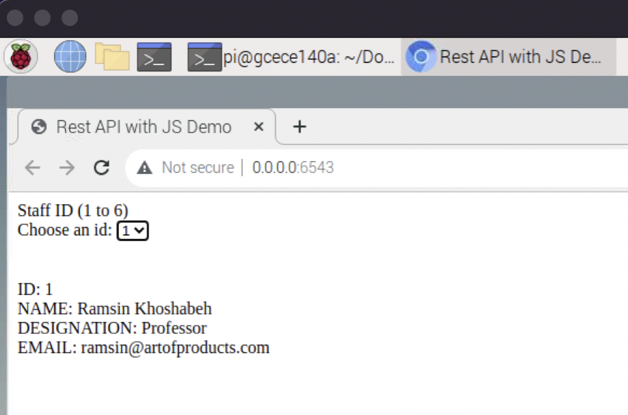
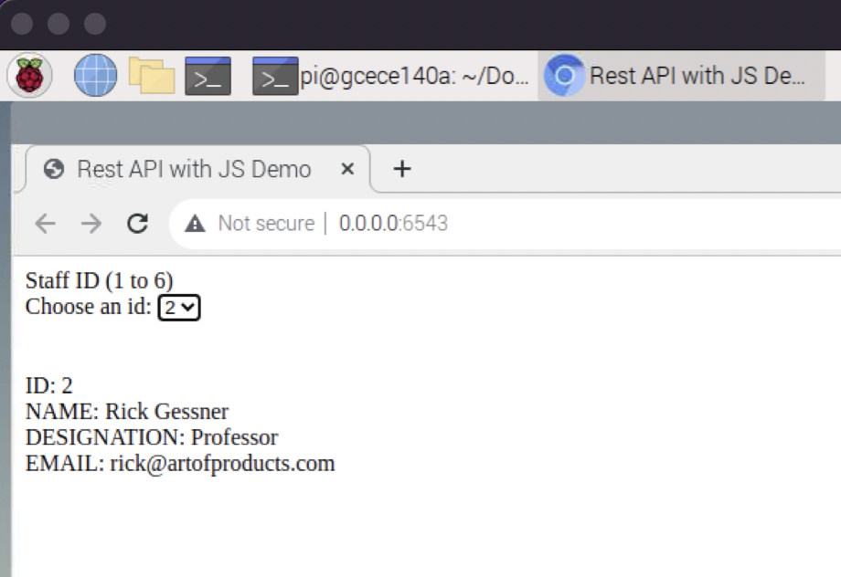
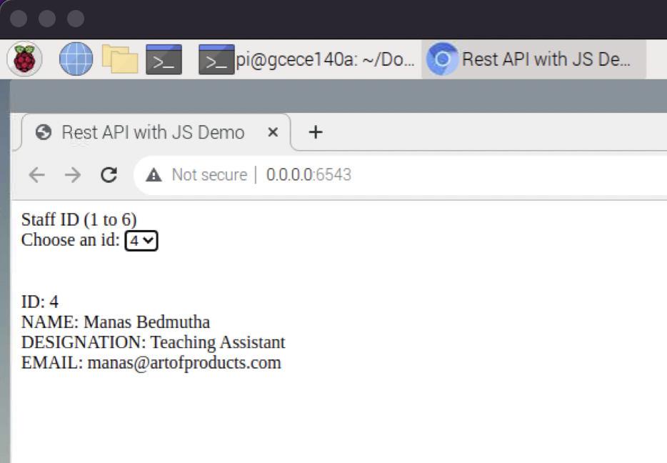
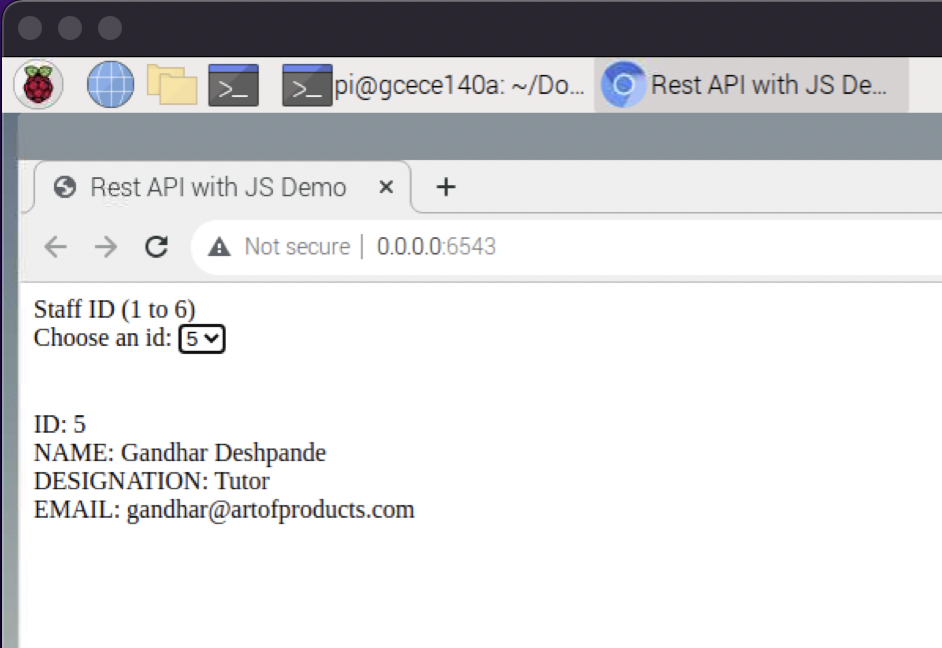
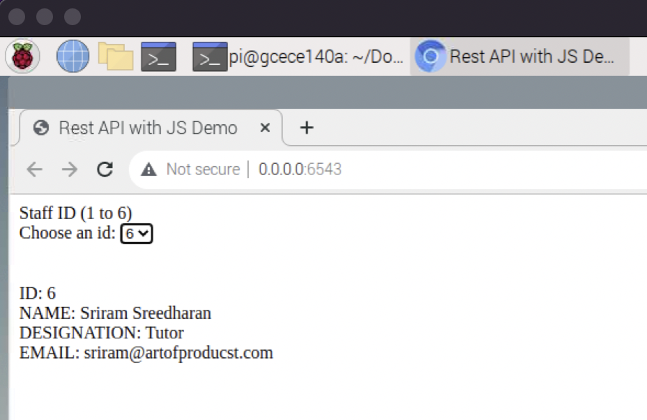

# Lab 6 Report: Midterm

# Prepared by: 
# Gino Calgaro, PID A15613364
# Rasya Soeroso, PID A16088908

# Date: 2/21/22

## Tutorials

### Tutorial 1: Setup Raspberry Pi
    
This tutorial 

  

### Tutorial 2: Tutorial 2: Basic I/O

This tutorial 

  

## Challenges

### Challenge 1: Midterm

For our Midterm, we decided to implement a website that offers feedback on lighting, temperature, and humidity conditions, as they pertain to household plants!

In order to implement this, we decided to use the Photoresistor (to measure light) and the DHT11 sensor (to measure temperature and humidity), which were both included in our starter kit.

As an extra feature, we added an LED bar graph that interacts with a button on the webpage.

Here is an image of the final breadboard circuit:

  

 <b><i>We can see that the circuit contains all the components necessary for our implementation.</i></b> 

#### Our sensor sampling works as follows:

The user first chooses which plant they would like to consider. Next, the user chooses which sensor(s) to read from and at which frequency.

The frequencies:

<ol>
	<li> Just now: Sensors are sampled once; one entry is entered into each respective MySQL table for the sensors.</li>
	<li> 1 min: The sensors are sampled for one minute. <b>NOTE:</b> the DHT11 sensor takes about 2.5 seconds to sample. This rate is reflected accordingly in the sample times, i.e. the sample rate is about one reading every 3 seconds.</li>
	<li> 5 mins: The sensors are sampled for 5 minutes. Again, if the sensor includes the DHT11, we have to reduce our sampling rate.
</ol>

Once the user has chosen all of the above criteria, they hit the 'Submit' button and the sensors are sampled. If the sensors are sampled more than once (i.e. sampled for 1 min or 5 mins), a timer appears on the webpage and begins a countdown accordingly.

### Code

To begin, we first had to create a new MySQL database, called Lab6. This database contains two tables, Photoresistor and DHT11. These tables contain the sampled values for both sensors.

  

 <b><i>Above is the code for initializing our database and tables. We can see that each table inserts a dummy value to begin.</i></b> 

Next, we designed an HTML webpage with all of the above criteria, as so:

  

 <b><i>All images, text, buttons, and dropdown lists are present on our HTML page. We can see that we have added aspects of CSS to the webpage too.</i></b> 

In order for our webpage to actually function correctly, we had to implement RESTful functions in both our app.py and rest.js files.

### Functions

#### get_everything(req):

