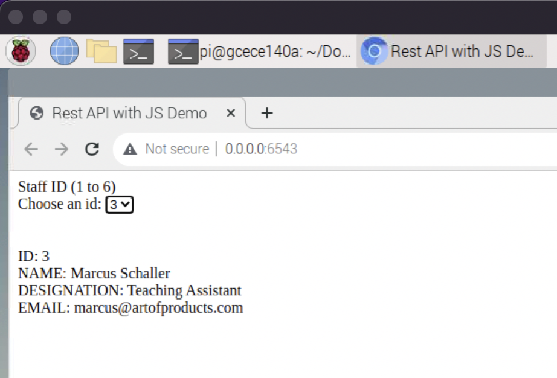

# LAB 6
Rasya Soeroso (A16088908)

Objective

## Tutorials

<!-- - __Tutorial 1: Setup Raspberry Pi__ -->
### Tutorial 1: Setup Raspberry Pi
    
This tutorial 

  

<!-- - __Tutorial 2: Tutorial 2: Basic I/O__  -->

### Tutorial 2: Tutorial 2: Basic I/O

This tutorial 

  

## Challenges

<!-- - __Challenge 1: Midterm__ -->
### Challenge 1: Midterm

